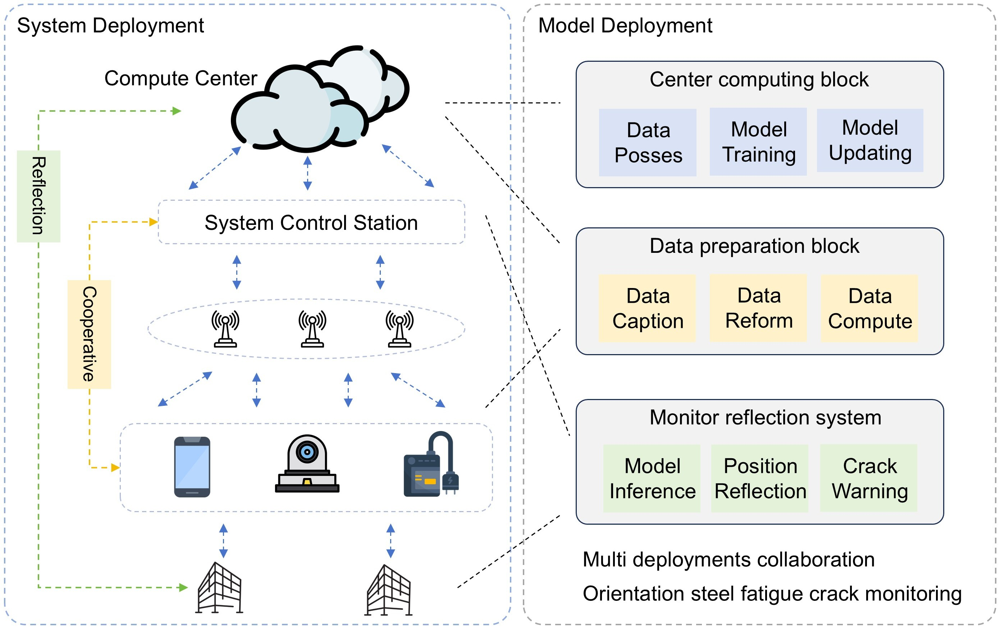

# OSCD
Orientation-Aware Detection System for Real-Time Monitoring of Cracks in Steel Structures. (ESWA 25)


<p align="center">
  
</p>
<p align="center">
  <em>Steel Structure Crack Monitor System.</em>
</p>

## 1. Detailed information
- The experiment setting configs are in [`configs`](./configs).  
- The heatmap generation script is in [`heatmap`](./heatmap.py).

## 2. Data and trained weights
Relevant datasets and trained model checkpoints can be accessed from our [Google Drive]([./](https://drive.google.com/file/d/1mx3-6L5cHQnNbVv01H9pf3DDu7zhF12z/view?usp=drive_link).

## 3. Implement
### 3.1 Environment Setup
```
pip install -r requirements.txt
```

### 3.2 Train
```
python train.py
```

### 3.3 Val
```
python val.py
```
### 3.4 Heatmap
```
python heatmap.py
```

# Note
```
@article{XIAO2025129932,
title = {Orientation-Aware Detection System for Real-Time Monitoring of Cracks in Steel Structures},
journal = {Expert Systems with Applications},
pages = {129932},
year = {2025},
issn = {0957-4174},
doi = {https://doi.org/10.1016/j.eswa.2025.129932},
url = {https://www.sciencedirect.com/science/article/pii/S095741742503547X},
author = {Hongru Xiao and Bin Yang and Yantao Yu and Jiale Han and Zhen Lian and Songning Lai},
keywords = {Steel Structure Crack, Orientation-aware, Orientation Bounding Box (OBB), Object Detection}
```
If you have problem, feel free to contact with me: hongru_xiao AT tongji DOT edu DOT cn.
